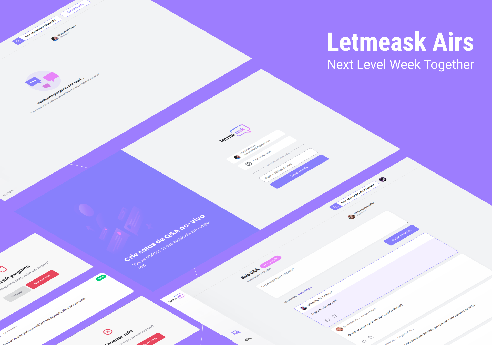
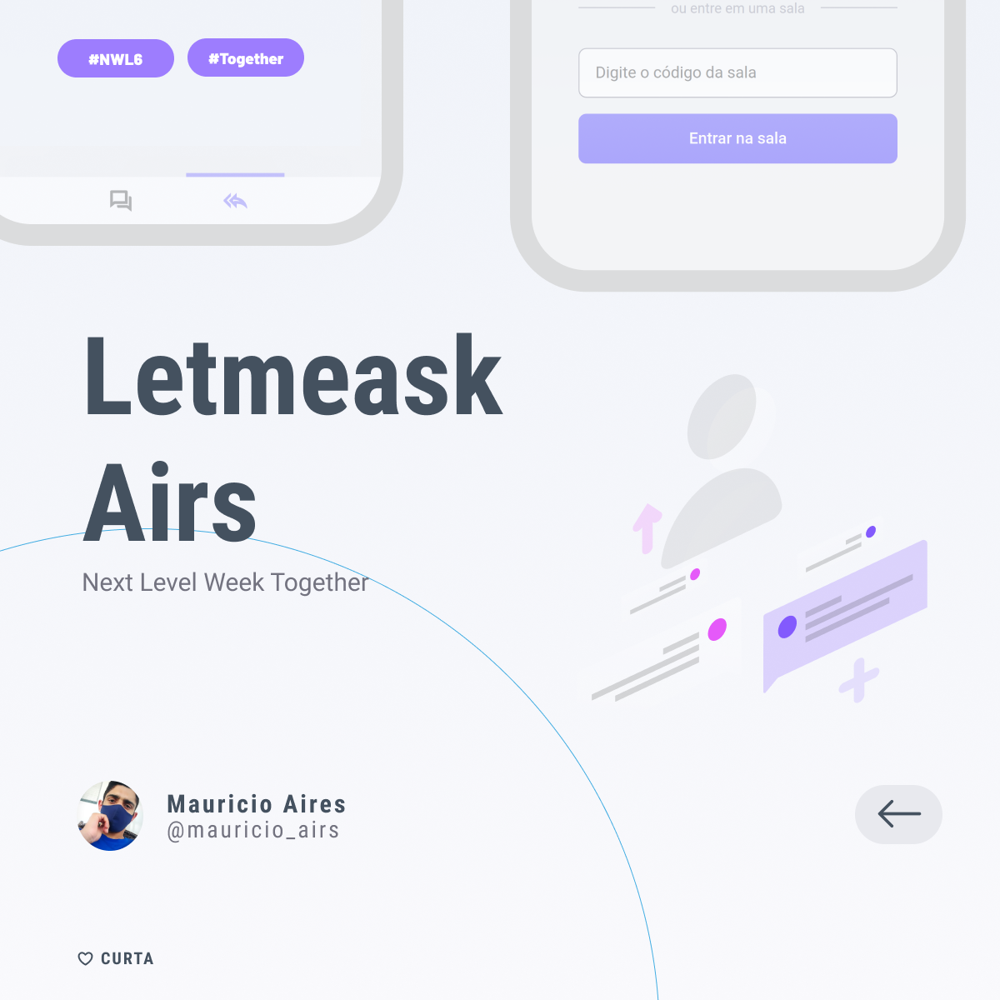
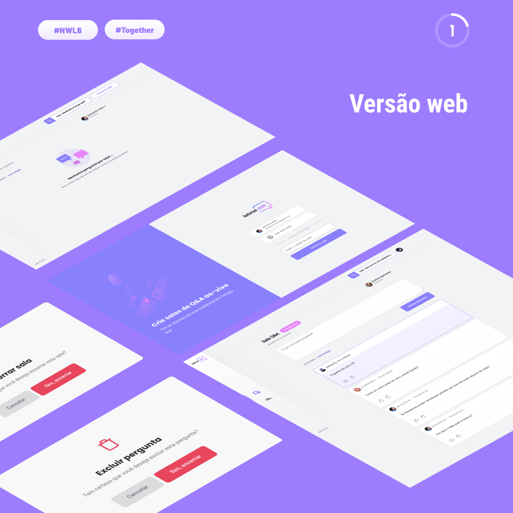
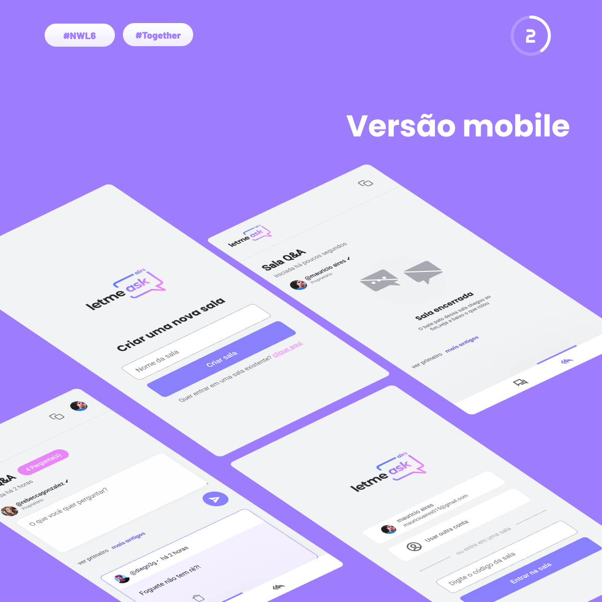
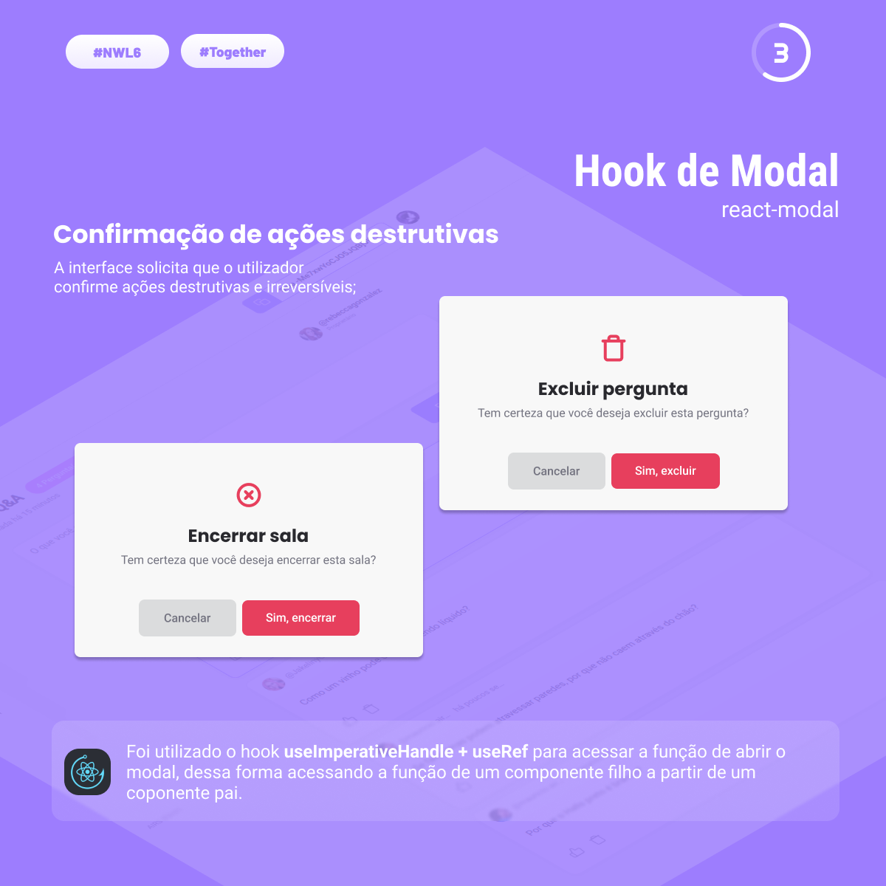
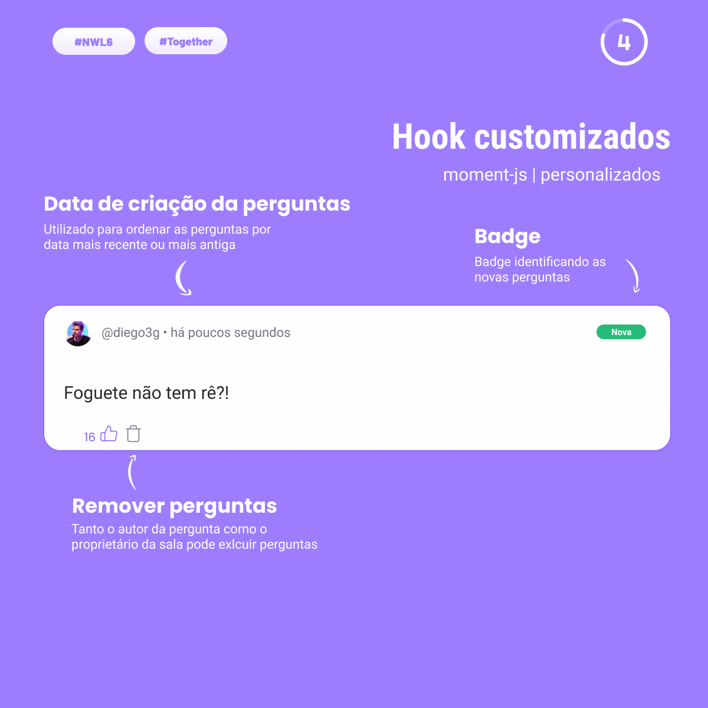
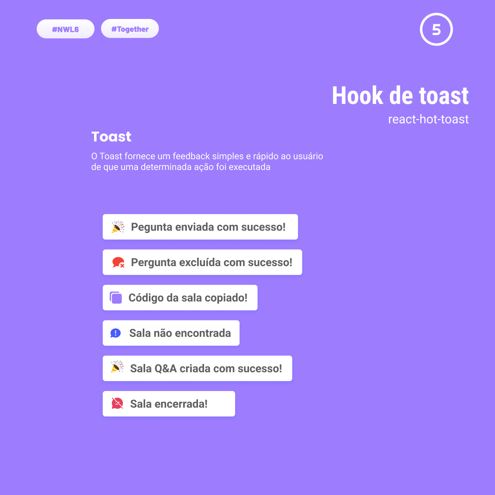

<h1 align="center">
  
</h1>

  <a href="#-tecnologias">Tecnologias</a>&nbsp;&nbsp;&nbsp;|&nbsp;&nbsp;&nbsp;
  <a href="#-plugins">Plugins</a>&nbsp;&nbsp;&nbsp;|&nbsp;&nbsp;&nbsp;
  <a href="#-projeto">Projeto</a>&nbsp;&nbsp;&nbsp;|&nbsp;&nbsp;&nbsp;
  <a href="#-layout">Layout</a>&nbsp;&nbsp;&nbsp;|&nbsp;&nbsp;&nbsp;
  <a href="#-licença">Licença</a>

  

  

  

  

  

 

## ✨ Tecnologias

- [React](https://reactjs.org)
- [TypeScript](https://www.typescriptlang.org/)
- [SCSS](https://sass-lang.com/)
- [Firebase](https://firebase.google.com/)

## ⚙ Plugins

- [react-hot-toast](https://github.com/timolins/react-hot-toast)
- [react-modal](https://github.com/JedWatson/classnames)
- [classnames](https://github.com/reactjs/react-modal)
- [momentJs](https://momentjs.com/)

## 💻 Projeto

Este projeto foi desenvolvido na semana de programação Next Level Week 6 organizada pela Rocketseat e ministrada pelo [Diego Fernandes](https://github.com/diego3g).

O Letmeask Airs é uma aplicação web com o propósito de criação de salas de perguntas e respostas ao-vivo. A aplicação pode ser usada para criar salas privadas de perguntas e respostas durante uma vídeo aula ou curso bem como em uma sala de aula. Os usuários podem realizar perguntas e as perguntas mas votadas terão um destaque e maior visibilidade para serem respondidas.

As salas são privadas onde o acesso só pode ser realizado por meio de autenticação e com o código que é gerado ao criar essa sala.

Firebase deploy: [https://letmeask-airs.web.app/](https://uber-1550976005202.web.app/)

## 🚀 Trilha extra

Durante o evento foi lançado o desafio de levar a aplicação para um proximo nível desenvolvendo algumas funcionalidades extras.

Dessa formar eu decidi avançar um pouco mais em efeitos visuais para melhorar e tornar o projeto ainda mais intuítivo, dentre as funcionalidades extras estão:

[✓] Criação de um Hook de Toast usando o react-hot-toast para usar em diversos momentos com avisos do sistemas

[✓] Hook de Modal usando o react-modal para ações críticas do sistema

[✓] Aplicação do useRef e useImperativeHandle para abrir o modal de ações

[✓] Ordenação de comentários por data de envio

[✓] Redirecionamento forçado de usuários/não usuários quando acessa a pagina admin sem está autenticado ou não é o proprietário da sala

[✓] Redirecionamento direto para a rota admin após criar a sala

[✓] Responsividade web e mobile

[✓] Menu de navegação entre a página de perguntas e a página de respostas/admin somente para o proprietário da sala

[✓] Identificação do proprietário da sala na página de perguntas

[✓] Data de criação da sala e das perguntas

[✓] Hook de Badge de identificação das novas perguntas

## 🔖 Layout

## 📄 Licença

Esse projeto está sob a licença MIT. Veja o arquivo [LICENSE](LICENSE) para mais detalhes.
